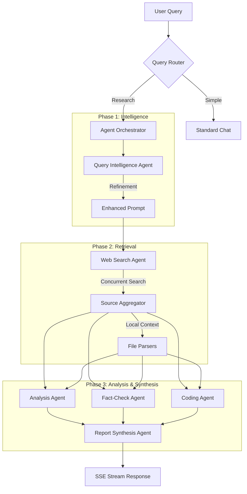

# 🔬 Research Agent Orchestrator

<div align="center">

[](https://nextjs.org/)
[](https://react.dev/)
[](https://tailwindcss.com/)
[](https://www.nvidia.com/en-us/ai/)

**Next-Generation Multi-Agent Research Engine**
*Transforming raw queries into structured, verified intelligence reports.*

</div>

---

## 🏗️ System Architecture & Flow

The system operates on an asynchronous state machine that prioritizes query intelligence before search execution to minimize hallucinatory drift.



---

## ⚡ Core Features Breakdown

*   **🌐 Intelligent Retrieval**: Powered by **Perplexity Sonar**, executing targeted concurrent searches based on agent-generated keywords rather than raw user input.
*   **🤖 Specialized Fleet Ops**:
    *   **Query Intelligence**: Automatically identifies sub-topics and cross-references them with primary intent.
    *   **Strategic Analysis**: Uses `NVIDIA/Nemotron-3-Super` for high-density reasoning and data synthesis.
    *   **Automated Verification**: The **Fact-Check Agent** compares synthesized claims against retrieved search snippets to flag contradictions.
    *   **Expert Synthesis**: Final reports are generated using `MoonshotAI/Kimi-K2-Thinking` for superior markdown structure and readability.
*   **🧠 Adaptive Routing**: Automatically shifts between specialized models for **Coding** (`Qwen-3-Coder`), **Reasoning**, and **Summarization** to optimize for both cost and quality.
*   **📄 Multi-Modal Intake**: Unified ingestion engine for `PDF`, `DOCX`, `CSV`, and `Images (OCR)` using high-performance WASM and browser-native libraries.
*   **🌊 Dynamic SSE Streaming**: Full transparency into the orchestration process. Real-time updates for every agent transition, latency metric, and model selection.

---

## 📖 Documentation & Integration

### **Agent Roles & Responsibilities**
*   **Analysis Agent**: Processes up to 8 distinct sources to find patterns, correlations, and strategic insights.
*   **Fact-Check Agent**: Performs cross-source validation. If Source A contradicts Source B, it flags the discrepancy in the "Verification" section.
*   **Coding Agent**: Activated only when `intent == "coding"`. Provides optimized snippets and architecture explanations.
*   **Report Agent**: The final "Editor-in-Chief" that ensures the final Markdown output remains professional and consistent.

### **API Endpoints**
| Method | Path | Description |
| :--- | :--- | :--- |
| **POST** | `/api/research` | Main SSE endpoint. Payload: `{ query, mode, files }`. |
| **GET** | `/api/health` | System health check and API provider validation. |

---

## 🚀 Getting Started

### **1. Installation**
```bash
# Clone and install
npm install
```

### **2. Environment Setup**
Create a `.env.local` file with the following keys:
```env
# REQUIRED
PERPLEXITY_API_KEY=xxx
NVIDIA_API_KEY=xxx

# OPTIONAL (Fallbacks)
OPENROUTER_API_KEY=xxx
```

### **3. Scripts**
*   `npm run dev`: Start local development server on port 3000.
*   `npm run build`: Generate production-optimized build.
*   `npm run lint`: Execute ESLint validation.

---

## 🌐 Connect & Connect

<div align="center">

### **Created by Girish Lade**

[](https://ladestack.in)
[](https://www.linkedin.com/in/girish-lade-075bba201/)
[](https://github.com/girishlade111)

[](https://www.instagram.com/girish_lade_/)
[](https://codepen.io/Girish-Lade-the-looper)
[](mailto:admin@ladestack.in)

</div>

---

## 📁 Project Structure

*   `app/api/research/`: Orchestrator execution layer.
*   `lib/engine/`: Core logic including agent prompts, model routers, and file parsers.
*   `components/`: Glassmorphic UI layout and agent tracking panels.

---

## 📄 License

This project is private and proprietary. All rights reserved.
